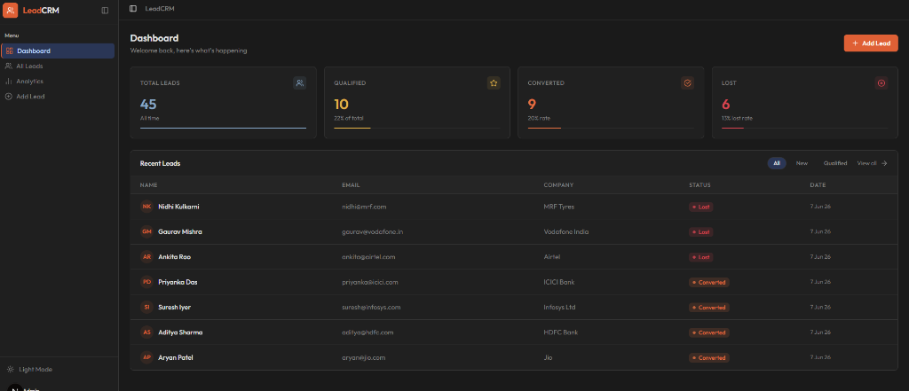
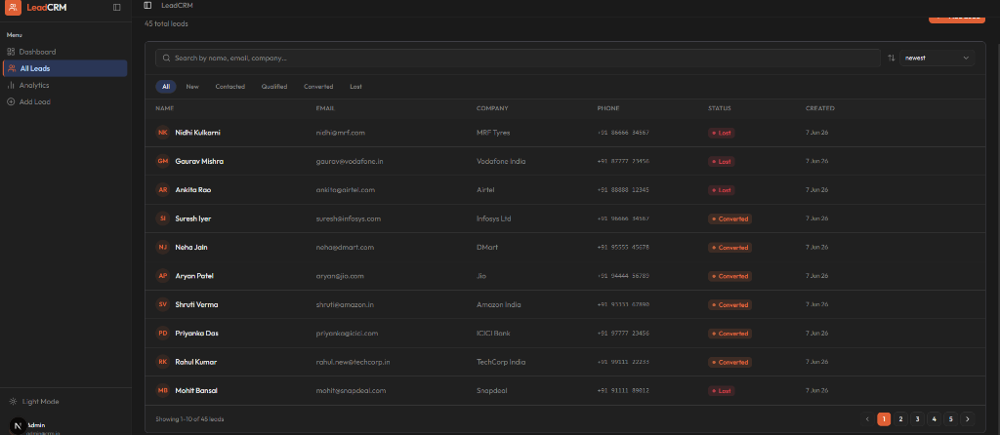
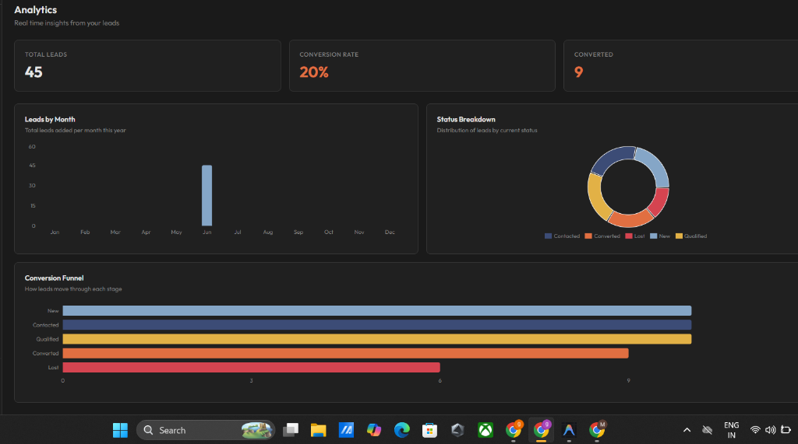

# 💼 LeadCRM — Lead Management System


**LeadCRM** is a full-stack Lead Management System built for small businesses. It allows sales teams to track prospects, manage follow-ups, and visualize pipeline performance — all from a single, responsive dashboard.

---

## 🔗 Live Demo

**Deployed Application:** [https://crm-seven-sooty.vercel.app/](https://crm-seven-sooty.vercel.app/)

---

## 🖼️ Application Preview

### 📊 Dashboard


### 👥 All Leads


### 📈 Analytics


---

## ✨ Features

- **➕ Add & Manage Leads** — Create leads with full contact details including name, email, phone number, company, status, and notes.
- **📋 Lead Dashboard** — At-a-glance stats for total leads, qualified, converted, and lost counts with live data from MongoDB.
- **🔄 Status Tracking** — Update any lead's lifecycle stage: `New → Contacted → Qualified → Converted → Lost`.
- **🔍 Search & Filter** — Search leads by name, email, or company. Filter by status with one click.
- **↕️ Sorting** — Sort leads by newest, oldest, or name (A–Z / Z–A).
- **📄 Pagination** — Server-side paginated lead list supporting up to 10 leads per page with navigation controls.
- **✏️ Edit Lead Details** — Update any field on an existing lead via a dedicated edit page.
- **🗑️ Delete Leads** — Remove leads with a confirmation dialog to prevent accidental deletion.
- **📈 Analytics Page** — Visual charts powered by Recharts: leads by month (bar chart), status breakdown (donut chart), and conversion funnel (horizontal bar).
- **🌙 Dark / Light Mode** — System-aware theme toggle built into the sidebar footer.
- **📱 Responsive Design** — Mobile-first layout with a collapsible sidebar, mobile card views, and adaptive grids.

---

## 🛠️ Technical Stack

| Category          | Technologies                                      |
|-------------------|---------------------------------------------------|
| **Framework**     | Next.js 16 (App Router, Server Components)        |
| **Frontend**      | React 19, React Hook Form, Zod validation         |
| **UI Components** | shadcn/ui, Tailwind CSS v4, Lucide React, Sonner  |
| **Charts**        | Recharts                                          |
| **Database**      | MongoDB + Mongoose                                |
| **Font**          | Outfit (Google Fonts)                             |
| **Deployment**    | Vercel (frontend + API routes)                    |

---

## ⚙️ Environment Configuration

Create a `.env.local` file in the project root before running the application.

> [!WARNING]
> Never commit your `.env.local` file to a public repository. It is already listed in `.gitignore`.

### 🔐 `.env.local`

```env
MONGODB_URI=mongodb+srv://<username>:<password>@cluster.mongodb.net/<dbname>?retryWrites=true&w=majority
```

**How to get your MongoDB URI:**
1. Go to [MongoDB Atlas](https://cloud.mongodb.com/) and sign in (or create a free account).
2. Create a new **Cluster** (the free M0 tier works fine).
3. Click **Connect → Drivers** and copy the connection string.
4. Replace `<username>` and `<password>` with your Atlas database user credentials.
5. Replace `<dbname>` with any name you like (e.g., `leadcrm`).

---

## 🚀 Local Setup Guide

Follow these steps to run the project on your local machine.

### 1️⃣ Clone the Repository

```bash
git clone https://github.com/your-username/crm.git
cd crm
```

### 2️⃣ Install Dependencies

```bash
npm install
```

### 3️⃣ Configure Environment Variables

Create a `.env.local` file in the project root:

```bash
# Windows
copy NUL .env.local

# Mac / Linux
touch .env.local
```

Then open `.env.local` and add your MongoDB connection string:

```env
MONGODB_URI=mongodb+srv://<username>:<password>@cluster.mongodb.net/leadcrm?retryWrites=true&w=majority
```

### 4️⃣ (Optional) Seed the Database

To quickly populate the database with 45 sample leads for testing:

```bash
node src/seed.js
```

> Make sure `.env.local` is configured correctly before running the seed script.

### 5️⃣ Start the Development Server

```bash
npm run dev
```

The application will be available at **[http://localhost:3000](http://localhost:3000)**.

---

## 📦 API Routes Reference

All API routes are handled via **Next.js Route Handlers** inside `src/app/api/`.

### 🗂️ Lead Management (`/api/leads`)

| Method   | Endpoint           | Description                                        |
|----------|--------------------|----------------------------------------------------|
| `GET`    | `/api/leads`       | Get all leads (supports `search`, `status`, `sort`, `page`, `limit` query params) |
| `POST`   | `/api/leads`       | Create a new lead                                  |
| `GET`    | `/api/leads/:id`   | Get a single lead by ID                            |
| `PUT`    | `/api/leads/:id`   | Update an existing lead                            |
| `DELETE` | `/api/leads/:id`   | Delete a lead by ID                                |

### 📊 Stats (`/api/leads/stats`)

| Method | Endpoint           | Description                               |
|--------|--------------------|-------------------------------------------|
| `GET`  | `/api/leads/stats` | Get aggregated counts by status for analytics |

### 🔍 Search Query Parameters

The `GET /api/leads` endpoint supports the following query parameters:

| Parameter | Type     | Description                                          |
|-----------|----------|------------------------------------------------------|
| `search`  | `string` | Search leads by name, email, or company (case-insensitive regex) |
| `status`  | `string` | Filter by status: `New`, `Contacted`, `Qualified`, `Converted`, `Lost` |
| `sort`    | `string` | Sort order: `newest`, `oldest`, `name_asc`, `name_desc` |
| `page`    | `number` | Page number for pagination (default: `1`)            |
| `limit`   | `number` | Number of results per page (default: `10`)           |

---

## 🗂️ Project Structure

```
crm/
├── src/
│   ├── app/
│   │   ├── api/
│   │   │   └── leads/
│   │   │       ├── route.js          # GET all, POST create
│   │   │       ├── [id]/route.js     # GET, PUT, DELETE by ID
│   │   │       └── stats/route.js    # Analytics stats
│   │   ├── leads/
│   │   │   ├── page.js               # All Leads page
│   │   │   ├── add/page.js           # Add Lead form
│   │   │   └── [id]/
│   │   │       ├── page.js           # Lead detail view
│   │   │       └── edit/page.js      # Edit Lead form
│   │   ├── analytics/page.js         # Analytics dashboard
│   │   ├── layout.js                 # Root layout with sidebar
│   │   ├── page.js                   # Main dashboard
│   │   └── globals.css               # Global styles & theme tokens
│   ├── components/
│   │   ├── Appsidebar.jsx            # Navigation sidebar
│   │   ├── RecentLeads.jsx           # Dashboard lead table
│   │   ├── StatusCards.jsx           # Stats cards
│   │   ├── StatusBadge.jsx           # Status pill badge
│   │   └── Deletebuttonlead.jsx      # Delete confirmation dialog
│   ├── models/
│   │   └── leadschema.js             # Mongoose Lead model
│   ├── lib/
│   │   └── db.js                     # MongoDB connection utility
│   └── seed.js                       # Database seed script
├── .env.local                        # Environment variables (not committed)
├── .gitignore
├── package.json
└── README.md
```

---

## 🚀 Deployment (Vercel)

This project is optimized for deployment on **Vercel**.

### Steps to Deploy

1. Push your repository to GitHub.
2. Go to [vercel.com](https://vercel.com) and click **"Add New Project"**.
3. Import your GitHub repository.
4. In the **Environment Variables** section, add:
   ```
   MONGODB_URI = mongodb+srv://...
   ```
5. Click **Deploy**. Vercel will automatically detect Next.js and configure everything.

> [!NOTE]
> Make sure your MongoDB Atlas cluster has **Network Access** set to allow connections from `0.0.0.0/0` (all IPs) so Vercel's serverless functions can connect.

---

## 📋 Required Lead Fields

| Field          | Type     | Description                                              |
|----------------|----------|----------------------------------------------------------|
| `name`         | `String` | Full name of the lead                                    |
| `email`        | `String` | Unique email address                                     |
| `PhoneNumber`  | `String` | Contact phone number                                     |
| `company`      | `String` | Company or organization name                             |
| `status`       | `Enum`   | `New` / `Contacted` / `Qualified` / `Converted` / `Lost` |
| `notes`        | `String` | Optional notes or remarks about the lead                 |
| `createdAt`    | `Date`   | Auto-generated timestamp (Mongoose `timestamps: true`)   |

---

## 🙌 Acknowledgements

- [Next.js](https://nextjs.org/) — Full-stack React framework with App Router.
- [shadcn/ui](https://ui.shadcn.com/) — Beautifully designed accessible component library.
- [MongoDB Atlas](https://www.mongodb.com/atlas) — Cloud-hosted NoSQL database.
- [Recharts](https://recharts.org/) — Composable charting library for React.
- [Lucide React](https://lucide.dev/) — Clean and consistent icon set.
- [Vercel](https://vercel.com/) — Seamless deployment platform for Next.js.
